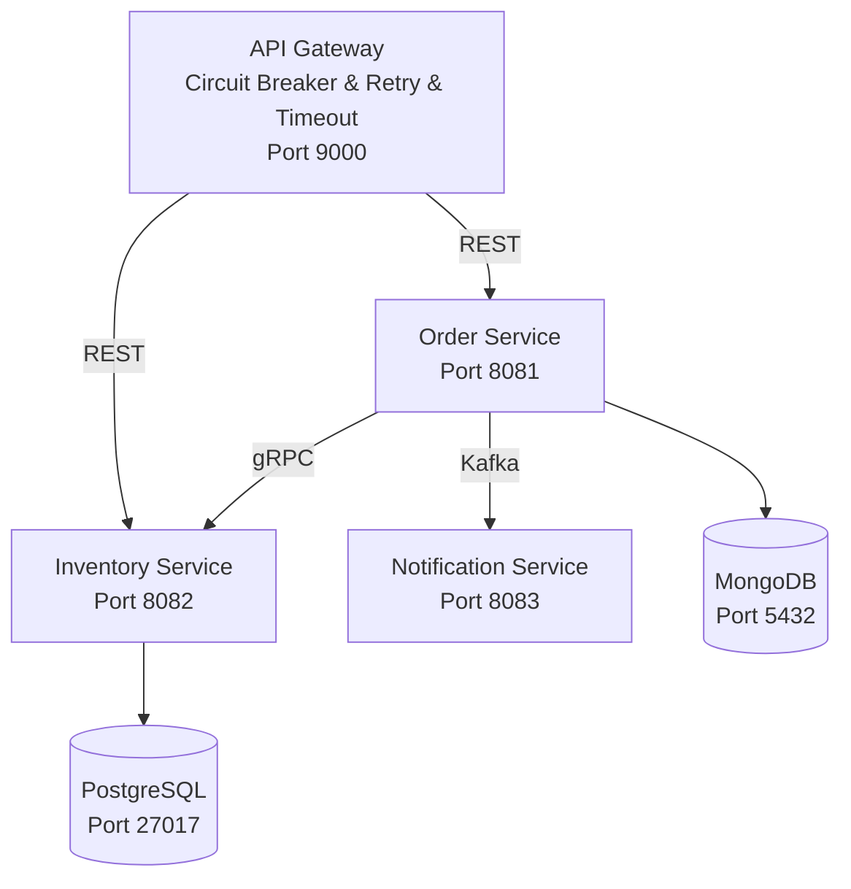

# Microservices E-Commerce System

## Architecture Overview



## Services

**API Gateway**: Routes requests to Order and Inventory Services (REST + Resilience4j)

**Order Service**: Processes orders, uses MongoDB for flexible order data

**Inventory Service**: Manages stock levels, uses PostgreSQL for ACID compliance and complex query.

**Notification Service**: Handles async notifications via Kafka

## Communication Patterns

**REST**: API Gateway → Order Service (with circuit breaker)

**gRPC**: Order Service → Inventory Service (high performance)

**Kafka**: Order Service → Notification Service (async events)

## Database Choice

**MongoDB for Orders**: Document structure fits nested order items

**PostgreSQL for Inventory**: Strong consistency for stock management

# To start
## Run Cluster
### Run k8s and deploy all services(needs to pull images, may take a while)
```bash
#cd k8s && ./deploy.sh && cd ..
kubectl apply -f k8s/namespace.yaml && kubectl apply -f k8s/
```
### Start API gateway proxy
```bash
minikube service api-gateway -n microservices-lab
```
### Start Kafka UI proxy
```bash
minikube service kafka-ui -n microservices-lab
```
## CleanUp
```bash
#kubectl delete namespace microservices-lab
kubectl delete -f k8s/
```

## (Optional) For developer local test and setup using docker compose
## Skip this, if you are simply trying to run this project
### Build Images
```bash
$ export DOCKER_ACCOUNT=YOUR_DOCKER_ACCOUNT && export DOCKER_PASSWORD=YOUR_DOCKER_PASSWORD && mvn spring-boot:build-image -DskipTests
```
### Start all services
```bash
docker compose -p zeli-lab4 up -d
```