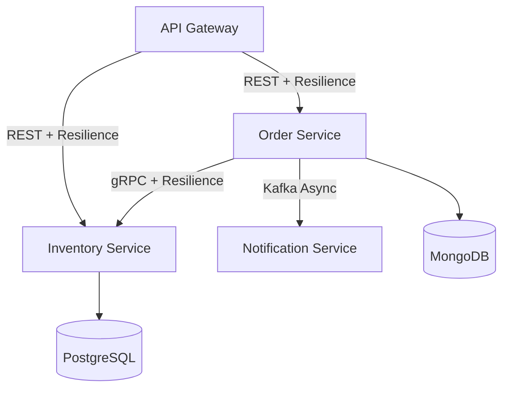

# Microservices E-Commerce System

## Architecture Overview



## Services

**API Gateway**: Routes requests to Order Service (REST + Resilience4j)

**Order Service**: Processes orders, uses MongoDB for flexible order data

**Inventory Service**: Manages stock levels, uses PostgreSQL for ACID compliance and complex query.

**Notification Service**: Handles async notifications via Kafka

## Communication Patterns

**REST**: API Gateway → Order Service (with circuit breaker)

**gRPC**: Order Service → Inventory Service (high performance)

**Kafka**: Order Service → Notification Service (async events)

## Database Choice

**MongoDB for Orders**: Document structure fits nested order items

**PostgreSQL for Inventory**: Strong consistency for stock management

# To start
## (Optional) Local Docker Compose Setup
### Start all services
```bash
docker compose -p zeli-lab4 up -d
```
### clean up all services
```bash
docker compose -p zeli-lab4 down --rmi all
```